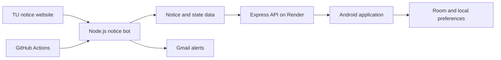

# TU Notice Sentinel


**TU Notice Sentinel** is a private Android notice-monitoring application for Tribhuvan University students. It connects securely to a Node.js/Express backend, displays notices and service status, provides bot controls, checks TU results, and periodically checks for new notices in the background.

The project is designed to stay simple and inexpensive:

- No Firebase dependency
- No paid push-notification service
- No Android Studio required for GitHub builds
- Personal information remains on the Android device
- API secrets and server credentials are never committed to GitHub

## Live service

- **API base URL:** `https://tu-notice-sentinel-api.onrender.com`
- **Health check:** `https://tu-notice-sentinel-api.onrender.com/health`
- **TU result portal:** `https://result.tuexam.edu.np/`

> The API root intentionally returns `404 Cannot GET /`. Use `/health` to check the server. The Android app authenticates through `/api/auth/token`.

## Main features

### Dashboard

- Live bot online/offline state
- Last checked and last successful run information
- Notice, email, scan, and stored-item counters
- TU website, scraper, state, Gmail, and GitHub Actions status
- Quick actions for checking notices, sending test email, running tests, controlling the bot, and triggering the workflow

### Notice management

- Five newest notices on the dashboard
- Complete notice archive
- Search by notice title or keyword
- Faculty/category filtering
- Read and unread tracking
- Mark all notices as read
- Clear/hide read notices
- Bookmark important notices for offline access
- Local Room database cache

### Background alerts

- Android WorkManager checks for new notices periodically
- Notification sound and vibration for newly discovered notices
- First synchronization is silent to avoid alerting for every existing notice
- Notification history is available inside the app

> Android periodic background work has a minimum interval of approximately 15 minutes and may be delayed by battery optimization or Doze mode. This is reliable background polling, not instant Firebase push messaging.

### TU results

- Built-in TU examination-results WebView
- Back/forward web navigation
- File and PDF download support
- Locally saved symbol number and date of birth
- Personal result archive
- Semester-wise records and average GPA/CGPA assistance

### Privacy and personalization

- Local profile dashboard
- Faculty and batch preferences
- Saved symbol number and date of birth
- Result history
- Bookmarked notices
- Download history and reading statistics
- Nepal Standard Time (`UTC+05:45`) throughout the app

Profile details, result records, bookmarks, and preferences are stored privately on the Android device. They are not uploaded to the backend.

## Architecture



## Repository structure

```text
tu-notice-sentinel/
├── .github/
│   └── workflows/
│       ├── android.yml       # Reusable Android build
│       ├── build-apk.yml     # Manual APK build button
│       └── bot.yml           # Existing bot workflow
├── android/                  # Kotlin Android application
│   ├── app/
│   ├── gradle/
│   ├── build.gradle.kts
│   ├── gradlew
│   └── settings.gradle.kts
├── data/                     # Runtime bot state/data
├── src/                      # Node.js backend and bot source
├── tests/                    # Backend tests
├── Dockerfile
├── package.json
└── README.md
```

## Android connection setup

Open **Settings** in the app and enter:

```text
HTTP API URL: https://tu-notice-sentinel-api.onrender.com
API Secret:   <the same API_SECRET configured on Render>
```

The URL may contain a trailing slash, but the recommended form is without one. Do not enter `/`, `/health`, `/api`, or `/api/auth/token` in the URL field—the app appends the correct paths itself.

The connection flow is:

```text
POST /api/auth/token
X-API-Key: <API_SECRET>
Content-Type: application/json
Body: {}
        ↓
Temporary JWT
        ↓
Authorization: Bearer <JWT>
        ↓
GET /api/status
        ↓
Dashboard connected
```

## API contract

### Public endpoints

| Method | Endpoint | Purpose |
|---|---|---|
| `GET` | `/health` | API health and version |
| `POST` | `/api/auth/token` | Exchange API secret for a temporary JWT |

Authentication request:

```bash
curl -X POST \
  'https://tu-notice-sentinel-api.onrender.com/api/auth/token' \
  -H 'X-API-Key: YOUR_API_SECRET' \
  -H 'Content-Type: application/json' \
  -d '{}'
```

### Protected endpoints

| Method | Endpoint | Purpose |
|---|---|---|
| `GET` | `/api/status` | Dashboard and bot status |
| `GET` | `/api/notices` | Notice archive |
| `GET` | `/api/notices/latest` | Latest notice |
| `GET` | `/api/logs` | Bot/API logs |
| `DELETE` | `/api/logs` | Clear logs |
| `GET` | `/api/notifications` | Notification history |
| `POST` | `/api/check` | Run a notice check |
| `POST` | `/api/bot/enabled` | Enable or disable the bot |
| `POST` | `/api/tests/run` | Run backend tests |
| `POST` | `/api/notifications/test` | Send a test email |

Protected request example:

```bash
curl \
  'https://tu-notice-sentinel-api.onrender.com/api/status' \
  -H 'Authorization: Bearer YOUR_TEMPORARY_JWT'
```

## Backend environment variables

Configure secrets in **Render → Environment**. Never add the real `.env` file to Git.

```dotenv
API_SECRET=replace_with_a_long_random_secret
GMAIL_USER=your_gmail_address
GMAIL_APP_PASSWORD=your_google_app_password
EMAIL_TO=notification_recipient
```

Other GitHub or bot-specific variables should remain in Render or GitHub Actions secrets, according to the backend configuration.

Generate a strong API secret with:

```bash
openssl rand -hex 32
```

## Build the APK without Android Studio

The included GitHub Actions workflows build the application in the cloud.

1. Push the project to GitHub.
2. Open the repository and select **Actions**.
3. Select **Build APK**.
4. Select **Run workflow** and confirm.
5. Wait for the green success check.
6. Download the APK artifact from the completed workflow run.
7. Extract the downloaded ZIP file.
8. Install `TU-Notice-Sentinel.apk`.

The artifact can contain both:

```text
TU-Notice-Sentinel.apk
TU-Notice-Sentinel-debug.apk
```

Install `TU-Notice-Sentinel.apk`. The second file is an explicitly named debug copy produced by the workflow.

## Local build

Android Studio is optional. With Java and the Android SDK installed, use:

```bash
cd android
./gradlew test assembleDebug
```

On Windows Command Prompt or PowerShell:

```powershell
cd android
.\gradlew.bat test assembleDebug
```

The generated APK is normally located at:

```text
android/app/build/outputs/apk/debug/app-debug.apk
```

## Backend tests

From the repository root:

```bash
npm ci
npm test
```

Check the deployed service:

```bash
curl 'https://tu-notice-sentinel-api.onrender.com/health'
```

Expected response structure:

```json
{
  "ok": true,
  "service": "tu-notice-sentinel-api",
  "version": "3.3.3"
}
```

## Installing and upgrading

1. Transfer the APK to the Android device.
2. Allow **Install unknown apps** for the file manager when prompted.
3. Open the APK and select **Install**.
4. Disable the unknown-app permission afterward if desired.

If Android reports an incompatible package or signature conflict, uninstall the older TU Notice Sentinel build and install the new APK. Uninstalling clears locally stored profiles, bookmarks, results, and settings, so export or record important information first.

## Required permissions

Depending on Android version, the app may request:

- Internet access for the Render API and TU results portal
- Notification permission for notice alerts
- Download/file access managed through Android's download service

For more reliable background checks, allow notifications and exclude the app from aggressive battery optimization when appropriate.

## Security checklist

- Keep the GitHub repository private if it contains operational details.
- Never commit `.env`, API secrets, Gmail passwords, GitHub tokens, keystores, or signing passwords.
- Use a Gmail **App Password**, never the normal account password.
- Use HTTPS for the API URL.
- Rotate exposed credentials immediately.
- Use least-privilege GitHub tokens.
- Keep signing keys in a secure offline backup.
- Do not post API secrets or tokens in screenshots, issues, or build logs.

Recommended `.gitignore` rules:

```gitignore
.env
.env.*
!.env.example
node_modules/
.idea/
*.log
*.jks
*.keystore
android/local.properties
android/.gradle/
android/**/build/
```

## Release checklist

- [ ] Backend health endpoint returns HTTP `200`
- [ ] Authentication returns a temporary JWT
- [ ] Dashboard connects and refreshes successfully
- [ ] Notices and latest notice load correctly
- [ ] Check Now works
- [ ] Test Email works
- [ ] Workflow trigger/status works
- [ ] Run Test works
- [ ] Enable/Disable Bot works
- [ ] Background notification permission is granted
- [ ] A newly detected notice produces one sound notification
- [ ] Result portal loads and downloads work
- [ ] Bookmarks and profile data remain after restarting the app
- [ ] `.env` and credentials are absent from Git history
- [ ] Final APK installs successfully on a real Android device

## Current versions

| Component | Version |
|---|---:|
| Android application | `4.0.0` |
| Render API/backend | `3.3.3` |

## Maintenance

Keep these workflow files even after the first successful build:

```text
.github/workflows/android.yml
.github/workflows/build-apk.yml
.github/workflows/bot.yml
```

They allow future Android builds and continued bot operation. Completed workflow runs and downloaded artifacts may be deleted from GitHub when they are no longer required.

## Disclaimer

TU Notice Sentinel is an independent student project and is not an official application of Tribhuvan University. Notice and result information should be verified through the official TU websites.

---

Built for private, secure, and convenient TU notice monitoring.
